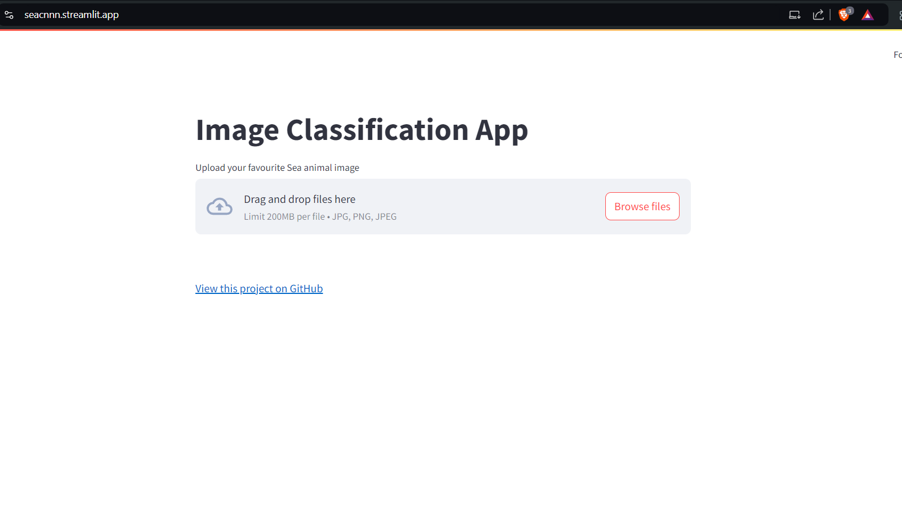

 

 

### About the project
Multiclass class classification of Marine animals images (13k RGB) of 23 classes by finetuning resnet50 predifined model.  
Model is saved as .keras file and deployed on web using streamlit. `/app1.py` file.  Achieved 82% accuracy on test data evaluation.
### Steps
0. Source of data https://www.kaggle.com/datasets/vencerlanz09/sea-animals-image-dataste
1. Took the raw images and converted them into the numpy array, it is in /data/data.zip  
   Check the `/notebooks/prosea.ipynb` file   
2. Preprocessed the data (undersampling to make the data balanced)  
3. Splitting the data into 3 parts: train data (60%), validation data (20%) and test data(20%)  
4. Converting y_train,y_val,y_test into onehot encoding (y_train,y_val,y_test are lables of data)  
5. Data Augumentation applied on train data (x_train) which consists of around 6000 images  
6. Initially trained on 30epochs with freezing the base model(resnet50) of train data and validation data, and then gradually unfreezing 10 layers,then 11 layers  
   of the base models with 25 epochs, Final validation accuracy is 81% without much overfitting.  
7. Evaluated on test data which gave an accuracy of 82%.  
   ->you can check all the procedure in `/notebooks/cnn_sage.ipynb`  
### Dependecies
To install the packages required run
> pip install -r requirements.txt
### Deployment
 Deployed on flask (`/app.py`) locally and streamlit (`/app1.py`) web. 
   To run the flask app locally run 
> python app.py
 
View the Site on https://seacnnn.streamlit.app/